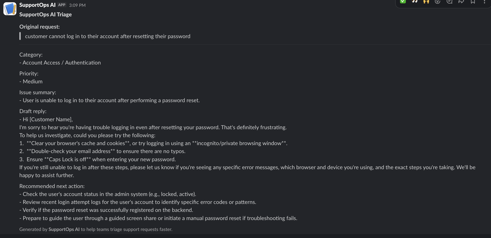
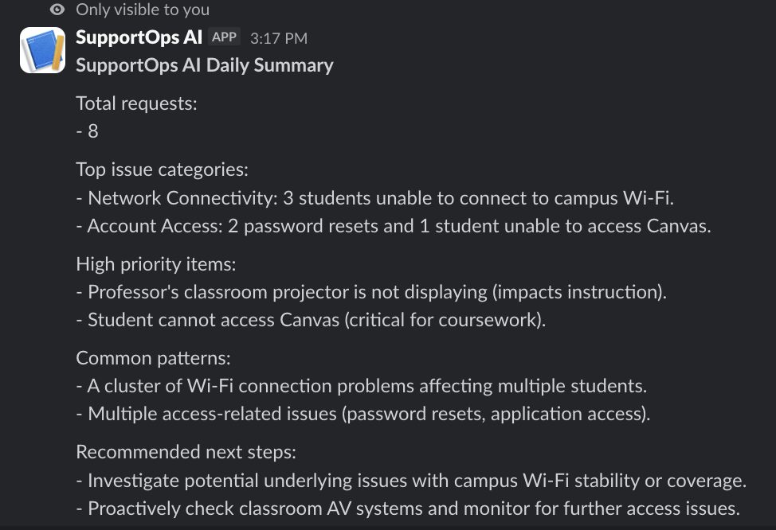

# SupportOps AI

SupportOps AI is a Slack bot that helps support teams quickly triage IT support requests and generate daily support summaries using Gemini AI.

## Features

- `/support` analyzes a support request
- Categorizes the issue
- Assigns priority
- Drafts a helpful reply
- Recommends the next action
- `/support-summary` creates a daily summary of support issues, patterns, and next steps

## Tech Stack

- Python
- Slack Bolt
- Gemini API
- GitHub Codespaces
- dotenv

## Commands

### Analyze a support request

Use `/support` to triage one support ticket.

```text
/support customer cannot log in
```

**Example output:**



---

### Generate a support summary

Use `/support-summary` to summarize multiple support issues and identify patterns.

```text
/support-summary 3 students cannot connect to campus Wi-Fi, 2 users need password resets, 1 professor's classroom projector is not displaying, 1 staff member reports a slow computer, 1 student cannot access Canvas
```

**Example output:**



---

## Environment Variables

Create a `.env` file with:

```env
SLACK_BOT_TOKEN=your_slack_bot_token
SLACK_SIGNING_SECRET=your_slack_signing_secret
GOOGLE_API_KEY=your_google_api_key
```

Do not commit your `.env` file to GitHub.

## Setup

Install dependencies:

```bash
pip install -r requirements.txt
```

Run the app:

```bash
python app.py
```

The app should show:

```text
Bolt app is running!
```

## Slack Setup

Create two slash commands in your Slack app:

```text
/support
/support-summary
```

Both commands should use the same Request URL:

```text
https://your-codespace-url-3000.app.github.dev/slack/events
```

## Demo Flow

1. Run `/support` with a single issue to show ticket triage.
2. Run `/support-summary` with multiple issues to show the daily support overview.
3. Use the screenshots above to quickly show what the bot returns in Slack.

## Status

Working MVP with Slack commands for ticket triage and daily support summaries.