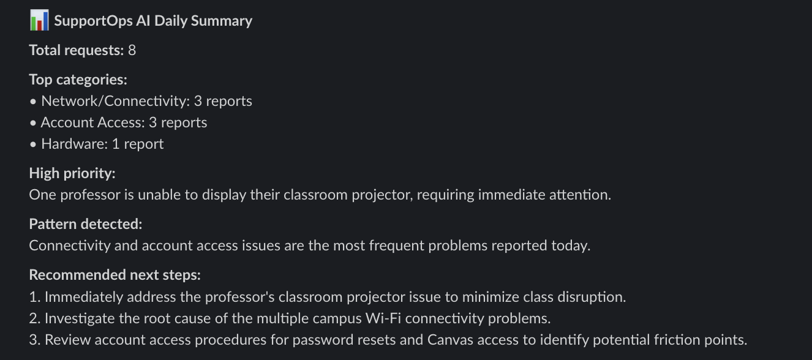
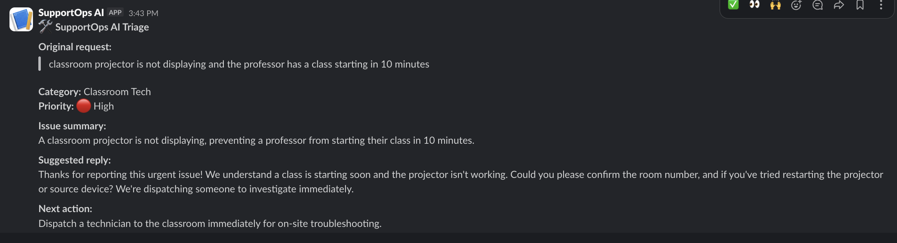

# SupportOps AI

SupportOps AI is a Slack bot that helps IT support teams triage requests, draft replies, and generate daily support summaries using Gemini AI.

## Features

- `/support` analyzes one support request
- Categorizes the issue
- Assigns priority
- Drafts a user-friendly reply
- Recommends the next support action
- `/support-summary` summarizes multiple issues and detects patterns

## Tech Stack

- Python
- Slack Bolt
- Gemini API
- GitHub Codespaces
- dotenv

## Demo Commands

### Support Triage

```text
/support classroom projector is not displaying and the professor has a class starting in 10 minutes
```

**Output:**



---

### Daily Support Summary

```text
/support-summary 3 students cannot connect to campus Wi-Fi, 2 users need password resets, 1 professor's classroom projector is not displaying, 1 staff member reports a slow computer, 1 student cannot access Canvas
```

**Output:**



---

## Environment Variables

Create a `.env` file:

```env
SLACK_BOT_TOKEN=your_slack_bot_token
SLACK_SIGNING_SECRET=your_slack_signing_secret
GOOGLE_API_KEY=your_google_api_key
```

Do not commit `.env` to GitHub.

## Run Locally

Install dependencies:

```bash
pip install -r requirements.txt
```

Run the app:

```bash
python app.py
```

Expected output:

```text
Bolt app is running!
```

## Slack Setup

Create two slash commands in the Slack app dashboard:

```text
/support
/support-summary
```

Both should use this request URL format:

```text
https://your-codespace-url-3000.app.github.dev/slack/events
```

## Project Status

Working MVP with polished Slack responses for support triage and daily support summaries.